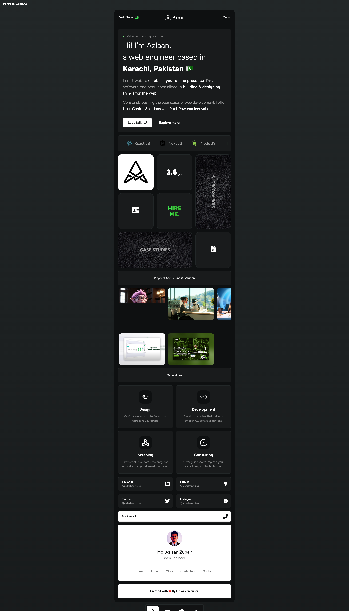

# v4: Personal Portfolio Website

This is the fourth portfolio I have made in `Jun 10, 2025`. It's just a re-designed of my previous portfolio. This iteration focuses on a refined user experience, emphasizing performance, accessibility, and a seamless presentation.

Also, I wanted to keep this portfolio for a few years, so I decided to do something fresh and simple but with a twist. I am really happy with the result. You can check it out live [here](https://v4.mdazlaanzubair.com).

## Preview

## Tech Stack

This project utilizes a modern and efficient tech stack for a high-performing and maintainable codebase:

- **React (v19):** JavaScript library for building the UI, known for its component-based architecture and virtual DOM.
- **Vite:** A fast build tool and development server for modern web development.
- **Framer Motion:** A production-ready motion library for React.
- **Tailwind CSS (v4):** A utility-first CSS framework that allows for rapid UI development and consistent design.
- **DaisyUI:** A component library for Tailwind CSS that provides a set of pre-designed UI components.
