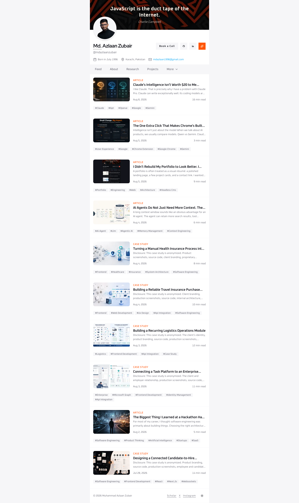

# v5: Personal Portfolio Website

This is the fifth portfolio I have made in `Aug 4, 2026`. It's just a re-designed of my previous overly animated portfolio. This iteration focuses on a refined user experience, emphasizing performance, accessibility, and a seamless presentation.

Also, I wanted to keep this portfolio for a few years, so I decided to go with a timeless design that won't go out of style anytime soon. Also, for content management I decided to use Sanity. which I am really happy with. I can update my portfolio anytime I want. Let's check it out live [here](https://v5.mdazlaanzubair.com).

## Preview

## Tech Stack

This project utilizes a modern and efficient tech stack for a high-performing and maintainable codebase:

- **Next.js (v16):** A powerful React framework for building performant and scalable web applications.
- **React (v19):** JavaScript library for building the UI, known for its component-based architecture and virtual DOM.
- **Tailwind CSS (v4):** A utility-first CSS framework that allows for rapid UI development and consistent design.
- **ShadCN UI:** A collection of reusable UI components for React.
- **Hashnode:** A blogging platform for sharing my thoughts and experiences.
